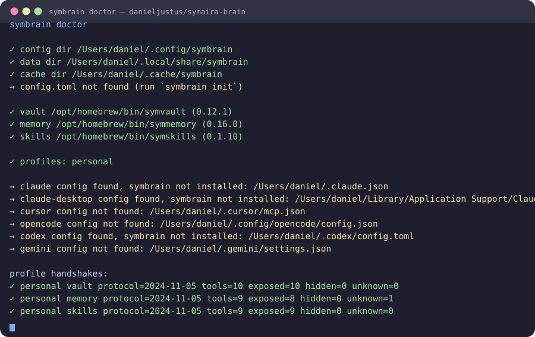
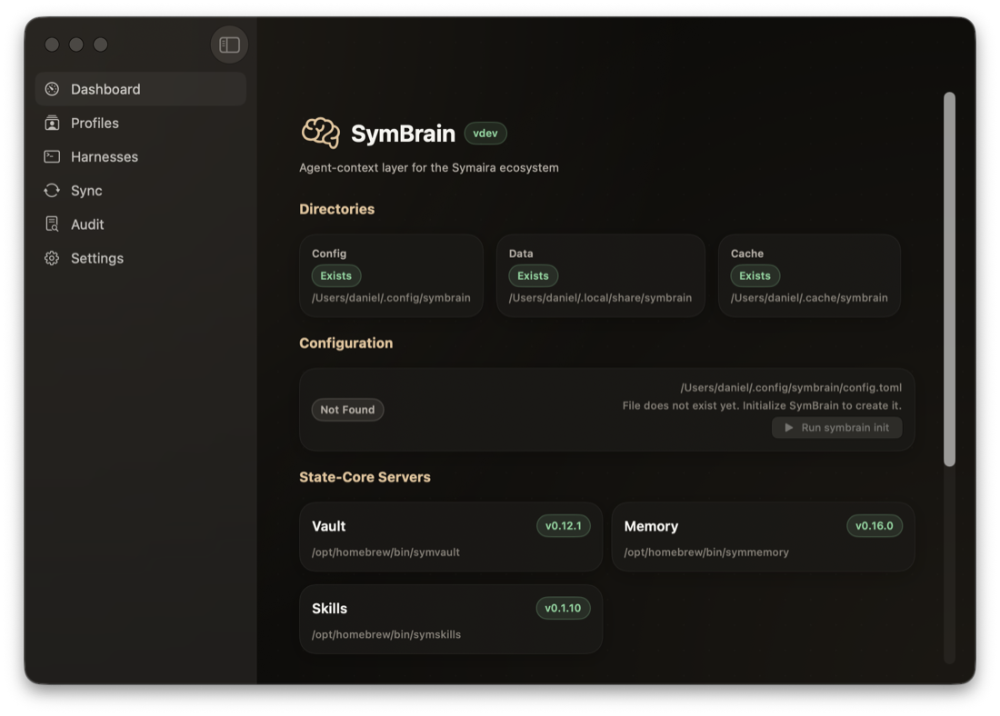

# Symaira Brain

[](https://github.com/danieljustus/symaira-brain/actions/workflows/ci.yml)
[](https://github.com/danieljustus/symaira-brain/releases/latest)
[](https://github.com/danieljustus/symaira-brain/tree/coverage-data)
[](LICENSE)
[](go.mod)



`symbrain` is the portable agent-context layer for AI coding harnesses. It
exposes the three Symaira *state cores* — credentials, memory/entities, and
the skill catalog — behind one MCP gateway, with one **profile** per harness
connection controlling exactly what that harness is allowed to see.

Memory and skills ship inside this binary (absorbed 2026-08-21); credentials
stay behind the separate `symvault` process on purpose.

Point Claude Code, Cursor, Codex, Gemini, or opencode at `symbrain` once, and
every one of them talks to the same underlying vault, memory, and skills —
each through its own profile, each seeing only what that profile exposes.

> **Status:** `v0.7.0` released, in active development. Interfaces may
> still change before `v1.0.0`.

## Why symbrain

- **One gateway, three state cores.** Credentials, memory, and the skill
  catalog behind a single MCP surface — one server to wire into a harness,
  not three.
- **Least exposure by profile, not by trust.** Each harness connection is
  bound to a profile that controls what it sees, so a shared or untrusted
  harness never even *sees* a tool that could read a secret.
- **Portable across every major harness.** Register once in Claude Code,
  Cursor, Codex, Gemini, or opencode and each talks to the same underlying
  cores through its own profile.
- **One binary, in-process.** Memory and skills are compiled in, so there is
  no multi-process dance for the common case; vault stays separate on purpose
  because that process boundary *is* the security mechanism.
- **Composable with `symguard`.** Capability shaping (what an agent can see)
  and conduct policing (what a call is allowed to do) are deliberately
  separate — put symguard in front when you need call-time enforcement.

## What symbrain is not

- **Not a generic MCP hub or aggregator.** It only multiplexes the three
  state cores above. General-purpose tools (web fetch, browser automation,
  search, etc.) are wired directly into the harness by the user — symbrain
  does not proxy them.
- **Not a call-time policy enforcer.** See the boundary table below —
  that job belongs to [`symguard`](guard/) (nested module, absorbed
  2026-08-21).
- **Not a memory store.** symbrain persists no memories and no secrets
  itself. It only holds profiles, the instructions source, and a local
  audit log.
- **Not a general-purpose GUI or desktop shell.** Native SwiftUI apps are
  included as companion dashboards for symbrain's own profiles, harnesses,
  audit log, and setup flows, plus module screens for the three state cores it
  brokers (Memory, Vault, Skills) driven through their own CLIs; the core
  product remains the CLI/MCP gateway.

### symbrain vs. symguard

Both tools sit between a harness and its tool servers, but answer a
different question:

| | **symbrain** | **symguard** |
|---|---|---|
| Question | *What is this agent even allowed to see?* | *Is this specific call allowed to happen right now?* |
| Mechanism | Capability shaping: filtered `tools/list`, servers on/off per profile, modes like vault `request_only` | Conduct policing: risk classification, allow/ask/deny/redact per call, human approval, schema pinning, hash-chain audit |
| Scope | Only the Symaira state cores | Any MCP server, any client |
| Timing | At handshake / catalog build | On every tool call |
| Audit | Lightweight JSONL log (who/what/when, redacted) | Tamper-evident audit (hash chain) |

If you need per-call approval, risk classification, or a tamper-evident
audit trail, put `symguard` in front of your servers. symbrain does not
implement any of that itself.

## Install

The fastest way is Homebrew:

```bash
brew install danieljustus/tap/symbrain
```

Or install a tagged release directly from the module path:

```bash
go install github.com/danieljustus/symaira-brain/cmd/symbrain@latest
```

To build from source instead, see the [Building](#building) section.

## Quickstart

After installing `symbrain`:

```bash
# 1. Create the XDG config/data/cache directories, a default config,
#    and two example profiles ("personal" and "restricted").
symbrain init

# 2. Register symbrain as an MCP server in Claude Code's config, bound
#    to the "personal" profile. --dry-run first if you want to preview
#    the exact change before it touches disk.
symbrain install --harness claude --profile personal --dry-run
symbrain install --harness claude --profile personal

# 3. Verify: symbrain doctor reports whether the environment, the state
#    core binaries, the profiles, and the harness registration all look
#    correct.
symbrain doctor
```

`symbrain doctor` after step 2 confirms the harness is wired up:

```text
✓  claude   installed, profile "personal": ~/.claude.json
```

Restart Claude Code (or reload its MCP connections) and the `symbrain`
server appears with the tools your profile exposes. Every gateway
connection also exposes two symbrain-owned tools that are never filtered
by profile policy: `bootstrap` (call it first — it reports what this
profile exposes and the live tool catalog) and `patterns` (promoted,
recurring tool sequences as read-only context). When the profile enables
`[servers.usage]`, a third gateway-owned tool, `get_ai_usage`, reports AI
subscription/token usage per provider (see `symbrain usage`). See the
[command reference](#command-reference).

Supported `--harness` values: `claude`, `claude-desktop`, `cursor`,
`opencode`, `codex`, `gemini`. `symbrain uninstall --harness <name>` reverses
step 2 and only ever touches the `symbrain` entry — every other server in
that harness's config is left alone.

## Profile guide

A profile is a TOML file under `~/.config/symbrain/profiles/<name>.toml`
that controls, per state core, whether it's exposed at all and — for vault
and memory — which named **mode** shapes the tool list. `symbrain init`
writes two starting points:

**`personal`** — full access for a trusted, single-user setup:

```toml
[servers.vault]
enabled = true
mode    = "full"

[servers.memory]
enabled = true
mode    = "read_write"

[servers.skills]
enabled = true
```

**`restricted`** — least-privilege, for an untrusted or shared harness
connection:

```toml
[servers.vault]
enabled = true
mode    = "request_only"

[servers.memory]
enabled = true
mode    = "read_only"

[servers.skills]
enabled = true
```

The mode is what makes the difference concrete. Run `symbrain profile show
restricted` and the tool list it prints backs up the claim: **a harness
bound to `restricted` can search memory but can never read a secret
directly.**

```text
vault: enabled=true mode=request_only
  effective exposed: generate_password, health, request_credential
  effective hidden:  find_entries, get_entry, get_entry_metadata,
                      set_entry_field, symaira_audit_self, symaira_search,
                      symaira_whoami

memory: enabled=true mode=read_only
  effective exposed: entity_list, entity_resolve, graph_neighbors,
                      memory_get, memory_list, memory_search
  effective hidden:  entity_relate, memory_set
```

`request_only` mode hides every tool that returns a secret value
(`get_entry`, `find_entries`, ...) and exposes only `request_credential` —
the flow where the *user's own* password manager UI supplies the credential
directly to the caller, never through the harness. `read_only` mode on
memory hides `memory_set`/`entity_relate` so a restricted harness can look
things up but never write.

Manage profiles with:

```bash
symbrain profile list                          # every profile + servers summary
symbrain profile show <name>                   # full detail incl. effective tool list
symbrain profile add <name> [--from personal|restricted]
symbrain profile remove <name> [--force]
```

A profile can also be handed to `mcp` as an explicit TOML file — e.g. a
room-local profile checked into a project — without touching the profiles
directory:

```bash
symbrain mcp --profile-file ./room-profile.toml
```

`--profile-file` and `--profile` are mutually exclusive; the file is
loaded verbatim.

For `version`, `sync`, and `profile`, output is explicitly a human-readable
**table by default**. Use the global `--output json` flag (or its `--json`
shorthand) for machine-readable output. The choice is not TTY-sensitive, so
piping a command does not silently change its output format; the output flags
may appear before or after the command's positional arguments.

## Command reference

Implemented today:

| Command | Purpose |
|---|---|
| `symbrain init` | Create XDG directories, default `config.toml`, and example profiles |
| `symbrain doctor [--json]` | Check environment, config, state-core binaries, profiles, harness registrations, and recent gateway degradations (state-core crashes/restarts; `degradations` in `--json` output) |
| `symbrain profile list \| show \| add \| remove` | Manage profiles under `~/.config/symbrain/profiles/` (`--output table\|json` applies to list/show) |
| `symbrain harness list [--project DIR]` | Inspect every known harness, its global/project config state, and registered MCP servers with transport detail (`--output table\|json`) |
| `symbrain harness health [--harness NAME] [--project DIR]` | Probe the MCP `initialize` handshake of every registered server (stdio servers only; concurrent, bounded per server) |
| `symbrain install --harness <name> --profile <name> [--project DIR] [--dry-run]` | Register symbrain as an MCP server in a harness's config |
| `symbrain uninstall --harness <name> [--project DIR] [--dry-run]` | Remove symbrain's entry from a harness's config (only that entry) |
| `symbrain mcp --profile <name> \| --profile-file <path> [--vault-agent <name>]` | Run the MCP gateway over stdio: merges the vault/memory/skills catalog per the bound profile and routes `tools/call` to the right child. `--profile-file` loads the profile from an explicit TOML file (e.g. a room-local profile) instead of the profiles directory; the two flags are mutually exclusive. `serve` is a deprecated alias for this command (stderr-only notice; see below) |
| `symbrain sync [--project DIR] [--dry-run] [<harness>...]` | Push the canonical instructions/skills source out to installed harnesses (`--output table\|json`, default `table`) |
| `symbrain memory sync --remote <url> [--pull\|--push] [--token <t>\|--encrypted-relay]` | Bidirectional remote memory sync against a Symaira Memory server (see `MEMORY-SYNC-MIGRATION.md`) — replaces the archived `symmemory sync` workflow. Reuses the local database in place; no export/import. Tokens and relay passphrases come from `--token`/`--relay-passphrase` or the `SYMBRAIN_MEMORY_SYNC_TOKEN` / `SYMBRAIN_MEMORY_SYNC_RELAY_PASSPHRASE` env vars (`--output table\|json`) |
| `symbrain audit tail [-n N] [--profile <name>] [--json]` | Inspect the local JSONL audit log — last `N` entries (default 20), optionally filtered by profile. `--json` emits a JSON array of entries |
| `symbrain version` | Print version, Go runtime, and OS/arch (`--output table|json`, default `table`) |

> The stdio gateway previously lived at `symbrain serve`; it moved to
> `symbrain mcp` (per the CLI vocabulary, `<tool> mcp` starts the stdio MCP
> server). `serve` remains as a deprecated alias for one minor release and
> prints its notice to **stderr only**, keeping stdout a clean JSON-RPC
> transport. Harness configs written by `install`/`sync` use `mcp`.
> Re-run `symbrain install` (or `symbrain sync`) after upgrading to refresh
> pre-existing harness entries.

### Harness inventory schema

`symbrain harness list --output json` emits schema version `2`. Each
server is an object carrying transport detail — how to reach it, not just
its name — so downstream consumers (e.g. symcockpit's MCP health view)
can connect without re-parsing harness configs:

```json
{
  "schema_version": 2,
  "project_dir": "/path/to/project",
  "harnesses": [
    {
      "name": "claude",
      "display_name": "Claude Code",
      "global": {
        "path": "~/.claude.json",
        "exists": true,
        "parsed": true,
        "servers": [
          {
            "name": "symbrain",
            "transport": "stdio",
            "command": "symbrain",
            "args": ["mcp", "--profile", "personal"]
          }
        ]
      },
      "project": {
        "path": "/path/to/project/.mcp.json",
        "exists": false,
        "parsed": false,
        "servers": []
      }
    }
  ]
}
```

Per server, `transport` is `stdio` or `http` (inferred from the entry
shape, or taken from an explicit `transport`/`type` field), `command` and
`args` describe the stdio invocation, and `url` the HTTP endpoint.
`env_names` lists the environment variable *names* an entry reads — **values
are never emitted**, so a config carrying a plaintext key cannot leak it
through the inventory.

`global` always describes the user-level config. `project` is included only
for harnesses with a project-local config and when `--project DIR` was given.
Missing files are reported with `exists: false`; malformed files keep
`exists: true`, set `parsed: false`, and include an `error` without aborting
the inventory. Consumers should treat `schema_version` as the compatibility
boundary and silently fall back to their built-in harness list when `symbrain`
is absent or returns an unsupported schema.

**Migration from schema 1.** Schema 1 reported `servers` as a list of bare
name strings; schema 2 replaces each entry with an object. Consumers that
only need names can read `.servers[].name`. A config entry with no command,
args, or url (e.g. a bare name placeholder) still appears with only `name`
and `transport` populated.

`install`/`uninstall` write a working MCP entry that *points at*
`symbrain mcp --profile <name>` — the harness spawns the gateway
automatically when it connects. Alongside the policy-filtered child
tools, the gateway registers two tools of its own that are never
filtered:

- **`bootstrap`** — call this first in every session. It returns the
  active profile's exposure summary (which cores and tool sets are
  available) and the live tool catalog, names only — vault values are
  never included.
- **`patterns`** — list promoted patterns: recurring tool-call sequences
  (episode names only, never arguments or values) that have recurred
  across sessions for this profile. Read-only context — symbrain never
  executes a pattern; artifacts that stabilize into durable authored
  content belong to symskills.
- **`get_ai_usage`** — profile-gated via `[servers.usage] enabled`. Fetches
  AI subscription/token usage across the ported providers (Claude, Codex,
  Copilot, Cursor, Kimi, Moonshot, Nous Portal, OpenCode, OpenRouter,
  Antigravity) and returns the same schema-versioned report as
  `symbrain usage --output json`. Read-only; unconfigured providers are
  reported as not set up, never as errors.

### Migration from `recipes`

The gateway-owned MCP tool was renamed from `recipes` to `patterns` in the
v0.8 line. Update clients that call the old tool name and rename the global
configuration section from `[recipes]` to `[patterns]`. Episode history stays
in the legacy `~/.local/share/symbrain/recipes/` directory and is read by the
new implementation without migration.

## Security notes

symbrain's job is **least exposure**, not call-time hardening — see the
boundary table above. Concretely:

- **What it protects against:** an over-broad harness connection seeing or
  using tools it has no business touching. A `restricted` profile's vault
  mode never exposes a tool that returns raw secret material — the harness
  literally cannot call `get_entry`, because that tool is absent from its
  `tools/list`, not merely discouraged.
- **What it does not protect against:** a malicious or compromised harness
  process abusing the tools its profile *does* expose (e.g. a `personal`
  profile with `vault` in `full` mode). There is no per-call approval, no
  risk scoring, and no human-in-the-loop confirmation in symbrain itself —
  that is `symguard`'s job.
- **Audit log:** when enabled (default: on), every routed tool call is
  recorded as JSONL under `~/.local/share/symbrain/audit/<profile>.jsonl`
  with who/what/when. Vault call arguments and results are never written to
  the audit log or to any error string, regardless of the `verbose` audit
  setting — `verbose` only adds non-vault tool arguments to the record,
  but content-bearing fields (e.g. memory `content`) are always redacted
  and values are capped at 256 characters.
- **Config files on disk:** profiles and the global config are written with
  `0o600` permissions; XDG directories are created `0o700`. Harness config
  files are backed up before symbrain edits them (`symbrain install` /
  `uninstall`).
- **Standalone by design:** symbrain never compiles against sibling repos.
  Child state-core binaries are located at runtime via `PATH` lookup with a
  timeout; a missing one is a `doctor` warning, never a hard failure.

Found a security issue? Please report it privately rather than opening a
public issue — see [SECURITY.md](.github/SECURITY.md) for how to report it.

## XDG paths

| Purpose | Path | Overridable via |
|---|---|---|
| Config (`config.toml`, profiles) | `~/.config/symbrain/` | — |
| Data (audit log) | `~/.local/share/symbrain/` | `$XDG_DATA_HOME` |
| Cache | `~/.cache/symbrain/` | `$XDG_CACHE_HOME` |

Config resolution intentionally does not consult `$XDG_CONFIG_HOME` (it
reuses `corekit/configkit`'s fixed path resolution), so a profile written by
`symbrain init` is always the exact file later commands read back.

## Building

Download the archive for your platform from the [latest GitHub
Release](https://github.com/danieljustus/symaira-brain/releases/latest),
extract it, and place `symbrain` on your `PATH`.

Or build from source:

```bash
git clone https://github.com/danieljustus/symaira-brain.git
cd symaira-brain
go build -o symbrain ./cmd/symbrain
./symbrain version
```

Requirements: Go 1.26+, `CGO_ENABLED=0` (the release build is CGO-free; see
`make build`).

### Development

```bash
make build       # CGO_ENABLED=0 go build -o symbrain ./cmd/symbrain
make test        # go test ./...
make test-race   # go test -race ./...
make lint        # golangci-lint if available, else go vet
make fmt         # gofmt -w -s .

# Full local check (mirrors CI):
go vet ./... && go test -race ./... && go build -o symbrain ./cmd/symbrain
```

See [AGENTS.md](AGENTS.md) for coding conventions, package layout, and the
full architectural boundary rules referenced above. See
[CONTRIBUTING.md](.github/CONTRIBUTING.md) for the PR process, and
[CODE_OF_CONDUCT.md](.github/CODE_OF_CONDUCT.md) for community
expectations.

## Native Apps

Native SwiftUI apps for macOS and iOS are included in the repo. They use
[`symaira-appkit`](https://github.com/danieljustus/symaira-appkit) for
theme, CLI runner, and tool detection.



### Build from source

```bash
brew install xcodegen   # if not already installed
./scripts/set-app-version.sh
xcodegen generate
xcodebuild build -project SymBrain.xcodeproj -scheme SymBrain -destination 'platform=macOS'
```

### Open in Xcode

```bash
./scripts/set-app-version.sh
xcodegen generate
open SymBrain.xcodeproj
```

**SymBrain** (macOS) is a full dashboard: doctor, profiles, harnesses, audit
log, and settings, plus a **Modules** sidebar for the three brokered state
cores — **Memory** (browse, search, rules, and query log), **Vault** (session
unlock with masked secrets, folder browsing, and TOTP), and **Skills** (library
with per-harness install state and dry-run sync), each with the broker audit
trail filtered to its own server. **SymBrainMobile** (iOS) is a read-only
companion showing the state-core overview, tool registry, and setup guide.

## License

Apache License 2.0 — see [LICENSE](LICENSE).